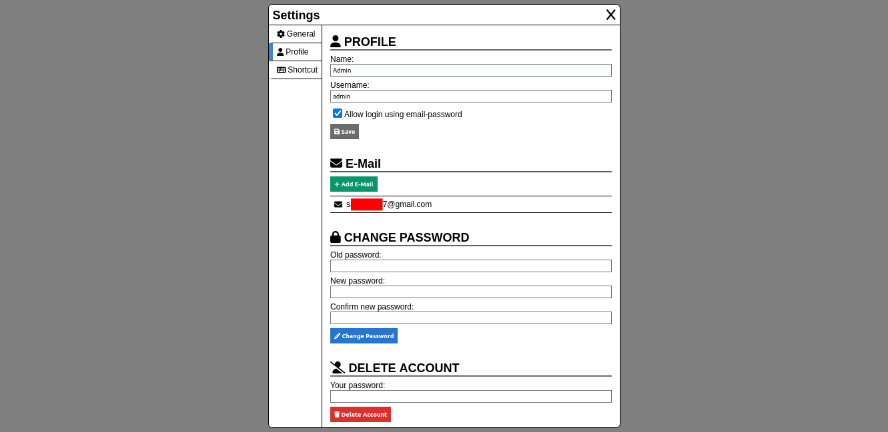

# Link Diagram Maker

## Configuration
Install dependency
```
npm install
```
copy `server/common/config.example.php` to `server/common/config.php` and `.env.example` to `.env`, then edit both.

## Features
- Light and dark theme
- Unique id for every diagram
- Autosave diagram
- Support multiple selection in editor
- Custom line dash style
- Login using google oauth
- Connect multiple email to the account
- Move note using keyboard arrow
- Undo and redo
- Customizable shortcut
- Fine-grained board access permission

## Screenshot
|  |
|:--:|
| *My Diagrams* |

|  |
|:--:|
| *Diagram Options* |

|  |
|:--:|
| *Sharing Option* |

|  |
|:--:|
| *Settings - General* |

|  |
|:--:|
| *Settings - Profile* |

|  |
|:--:|
| *Settings - Shortcut* |

|  |
|:--:|
| *Diagram Editor* |

|  |
|:--:|
| *Diagram Editor - Note Editor* |

|  |
|:--:|
| *Diagram Editor - Connection Editor* |

